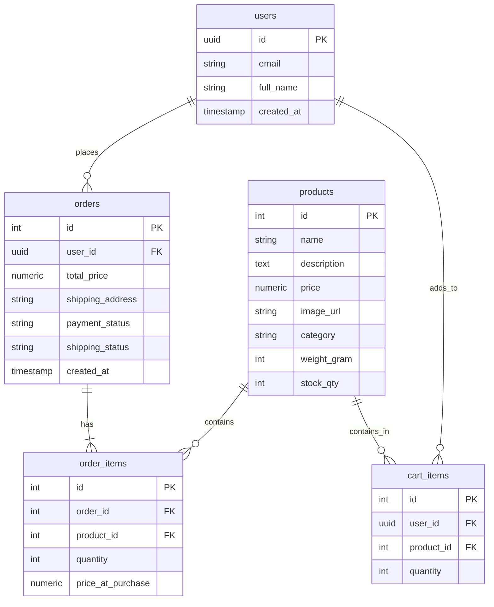

# 🗄️ Entity Relationship Diagram (ERD) - Supabase

Skema dasar database TrailForge di Supabase untuk menyimpan entitas bisnis.

```mermaid
erDiagram
    users ||--o{ orders : places
    users ||--o{ cart_items : adds_to
    products ||--o{ order_items : contains
    products ||--o{ cart_items : contains_in
    orders ||--|{ order_items : has

    users {
        uuid id PK
        string email
        string full_name
        timestamp created_at
    }

    products {
        int id PK
        string name
        text description
        numeric price
        string image_url
        string category
        int weight_gram
        int stock_qty
    }

    cart_items {
        int id PK
        uuid user_id FK
        int product_id FK
        int quantity
    }

    orders {
        int id PK
        uuid user_id FK
        numeric total_price
        string shipping_address
        string payment_status
        string shipping_status
        timestamp created_at
    }

    order_items {
        int id PK
        int order_id FK
        int product_id FK
        int quantity
        numeric price_at_purchase
    }
```
