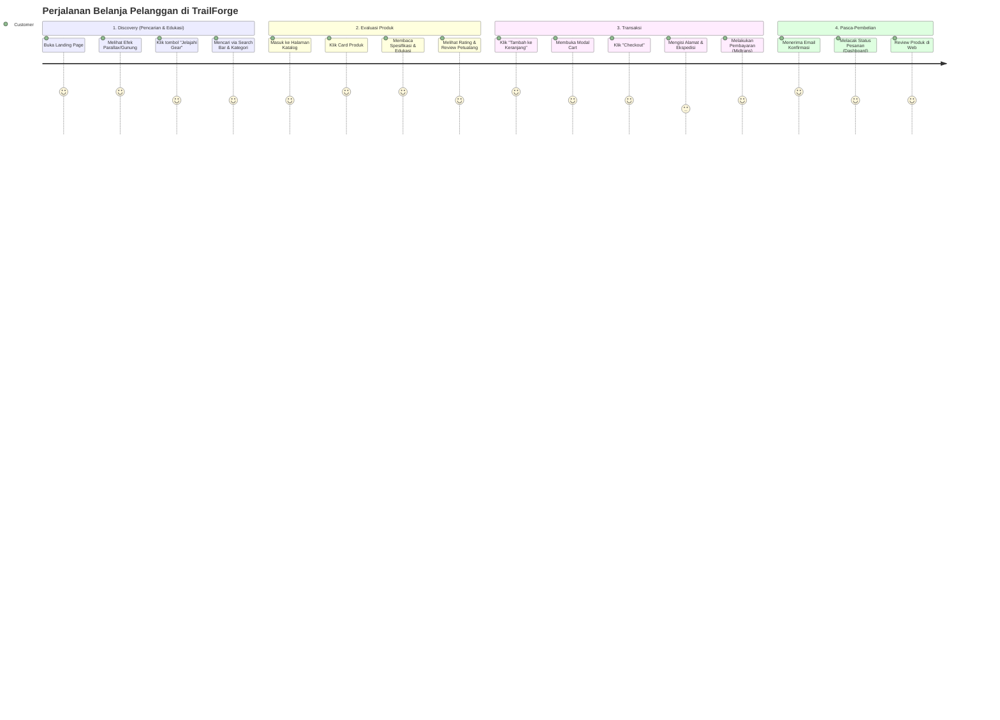

# 🗺️ User Journey: Alur Pengguna TrailForge

Dokumen ini memetakan alur interaksi (*User Journey*) seorang *customer* dari titik awal (_Landing Page_) sampai pesanan berhasil (_Checkout & Tracking_).

## Visualisasi Alur Pengguna (Mermaid)

## Penjelasan Fase (*Breakdown*)

### Fase 1: Discovery (Kesadaran)
*   **Aksi**: *User* tertarik dengan UI kita yang berasa "Hutan/Gunung" dan mengklik bagian *Jelajahi Gear*. 
*   **Emosi Diharapkan**: Terkesima, *excited*, merasa *trust/premium*.

### Fase 2: Evaluasi Produk
*   **Aksi**: Memerinci spesifikasi produk spesifik (misal: *Hammock Tent*). *User* membaca jurnal / tips cara pasang *hammock* tersebut di produk.
*   **Emosi Diharapkan**: Yakin karena produk diriset ketat, minim keraguan kualitas bahan.

### Fase 3: Transaksi
*   **Aksi**: Konversi. Keranjang belanja dirancang minim hambatan (*frictionless*), pemilihan logistik jelas, dibantu gerbang pembayaran QRIS atau Virtual Account otomatis.
*   **Emosi Diharapkan**: Aman dari penipuan, cepat proses bayarnya.

### Fase 4: Pasca-Pembelian (*Retention*)
*   **Aksi**: Mendapatkan nomor pelacakan unik di akun profil mereka, serta surel (*email*) konfirmasi pembayaran otomatis.
*   **Emosi Diharapkan**: Puas dan nantinya berlanjut ingin memberi *review*.
